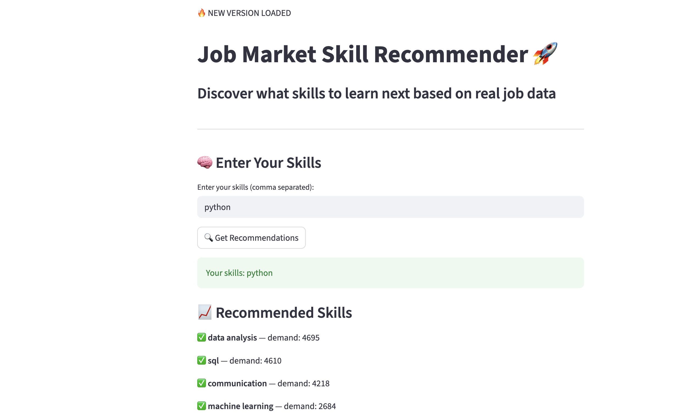

# job-skill-recommender
# 🚀 Job Market Skill Recommender

A data-driven web application that recommends in-demand skills based on real job market data.

---

## 🌐 Live App
https://job-skill-recommender-a9kpz52cqjq8ndbikdappgy.streamlit.app/

---

## 📌 Features
- Enter your current skills
- Get top recommended skills based on demand
- Handles unknown/non-relevant skills
- Built using real-world dataset

---

## 🛠️ Tech Stack

---

## 🚀 How It Works
1. Loads job skills dataset  
2. Cleans and processes skills  
3. Counts skill frequency  
4. Recommends missing high-demand skills  

---

## 💡 Example:
Input:
python

Output:
- sql
- data analysis
- machine learning
- aws

## 📸 App Preview

## 🤝 Contributing
Feel free to fork and improve the project!
